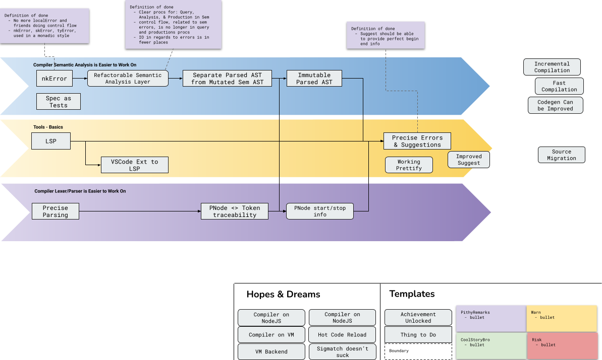

<div id="top"></div>

<br />

<div align="center">
  <a href="https://github.com/nim-works/nimskull">
    
  </a>

  <h3 align="center">NimSkull</h3>
  <p align="center">
    The Nim-Works compiler, stdlib, tools, and documentation repository.
    <br />
    <br />
    <a href="https://github.com/nim-works/nimskull/blob/devel/CODE_OF_CONDUCT.md">Code of Conduct</a>
    ·
    <a href="https://github.com/nim-works/nimskull/blob/devel/ETHOS.md">Code of Ethics</a>
  </p>

[][nim-works-matrix]

</div>

<br />


## About the Project

The Nim-Works compiler, stdlib, tools, and documentation repository. Nim-Works
is presently a derivative of [Nim][nim-site]. Its intention best described by:

> Nimskull is not an alternative implementation; it's a reimaging of the language
> that aims for a community where if one uses the language then they also
> contribute directly to the language. This is a community effort with a strong
> emphasis on sustainability, the contributor community comes first.
>
> As to why this fork exists, it's a matter of taste and this would not exist
> if governance, language design, type system, implementation choices, standard
> library, package management, and more had an acceptable trajectory.

Ultimately this will mean a different community, language, standard library,
and much more. For now it's closer to an alternative with most deviations
appearing in the standard library, mostly in the form of deleting much of it.

PS. the name `Nimskull` is temporary

See the [FAQ](#FAQ).

<p align="right">(<a href="#top">back to top</a>)</p>

## Near-Term Development




The current and key areas of development are as follows:
1. improve tests - clarify the language specification and memorialize it in tests.
   Reorganize existsing tests. [Project](https://github.com/nim-works/nimskull/projects/2)
   to track progress.
2. nkError - replace `localError` etc approach with an AST (`nkError`) one
3. comments - incrementally document compiler source for easier learning

<details><summary><b>Show more</b></summary><br />

There are more, the above have been carefully chosen based on the direction of
the language; moreover, their impact is far beyond as described and the
intention is to create a virtuous cycle, examples:

* clarifying the language specification will identify bugs and design flaws that
  in turn will be fixed.
* changes introduced via nkError result in more pure code (`func`) as control-
  flow and effects are no longer intertwined; lead to bug and language
  design fixes due to a broad audit, ease compiler as a library usage for tools

<p align="right">(<a href="#top">back to top</a>)</p>

</details>

## Community

Currently, this repository and our [matrix/irc][nim-works-matrix] are our primary community hubs; we'll introduce more as things grow. At this time our community is small but
passionate and close. We welcome any who are able and eager to collaborate on improving the compiler and associated tools.

Check the [FAQ](#FAQ), or [Project Board](https://github.com/nim-works/nimskull/projects) for an idea of where to help.

There's plenty to be done, and we appreciate even the smallest contribution to
documentation! We look forward to seeing introductions and pull requests!

<p align="right">(<a href="#top">back to top</a>)</p>

## Compiling

The compiler currently aims to support the following platform and
architecture combinations:

  * Windows (Windows XP or greater) - x86 and x86_64
  * Linux (most, if not all, distributions) - x86, x86_64, ppc64 and armv6l
  * Mac OS X (10.04 or greater) - x86, x86_64, ppc64 and Apple Silicon (based on the ARM64 architecture)

More platforms will be supported, however, they are not tested regularly and they
may not be as stable as the above-listed platforms.

Compiling the compiler is quite straightforward if you follow these steps:

<details>
  <summary>Show</summary>
  <br />

First, the C source of an older version of the compiler is needed to
bootstrap the latest version because the compiler itself is written in the
programming language. Those C sources are available within the
[``nim-lang/csources_v1``][csources-v1-repo] repository.

Next, to build from source you will need:

  * A C compiler such as ``gcc`` 3.x/later or an alternative such as ``clang``,
    ``Visual C++`` or ``Intel C++``. It is recommended to use ``gcc`` 3.x or
    later.
  * Either ``git`` or ``wget`` to download the needed source repositories.
  * The ``build-essential`` package when using ``gcc`` on Ubuntu (and likely
    other distros as well).
  * On Windows MinGW 4.3.0 (GCC 8.10) is the minimum recommended compiler.
  * Nim hosts a known working MinGW distribution:
    * [MinGW32.7z](https://nim-lang.org/download/mingw32.7z)
    * [MinGW64.7z](https://nim-lang.org/download/mingw64.7z)

**Windows Note: Cygwin and similar POSIX runtime environments are not supported.**

Then, if you are on a \*nix system or Windows, the following steps should compile
Nim from source using ``gcc``, ``git``, and the ``koch`` build tool.

**Note: The following commands are for the development version of the compiler.**

First, get the compiler from github:

```
git clone https://github.com/nim-works/nimskull.git
cd nimskull
```

Next, run the appropriate build shell script for your platform:

* `build_all.sh` (Linux, Mac)
* `build_all.bat` (Windows)

Finally, once you have finished the build steps (on Windows, Mac, or Linux) you
should add the ``bin`` directory to your PATH.

</details>

<p align="right">(<a href="#top">back to top</a>)</p>

## Contributing

**NB: This has not been updated from the original Nim section. See the [FAQ](#FAQ)**

>Before you start contributing, you should familiarize yourself with the
following repository structure:
>
><details>
>  <summary>Show structure</summary>
>  <br />
>
>* ``bin/``, ``build/`` - these directories are empty, but are used when Nim is >built.
>* ``compiler/`` - the compiler source code. Also includes nimfix, and plugins within
>  ``compiler/nimfix`` and ``compiler/plugins`` respectively.
>* ``nimsuggest`` - the nimsuggest tool.
>* ``config/`` - the configuration for the compiler and documentation generator.
>* ``doc/`` - the documentation files in reStructuredText format.
>* ``lib/`` - the standard library, including:
>    * ``pure/`` - modules in the standard library written in pure Nim.
>    * ``impure/`` - modules in the standard library written in pure Nim with
>    dependencies written in other languages.
>    * ``wrappers/`` - modules that wrap dependencies written in other languages.
>* ``tests/`` - contains categorized tests for the compiler and standard library.
>* ``tools/`` - the tools including ``niminst`` and ``nimweb`` (mostly invoked via
>  ``koch``).
>* ``koch.nim`` - the tool used to bootstrap Nim, generate C sources, build the >website, and generate the documentation.
></details>
>
>Ideally, you should make sure that all tests pass before submitting a pull request.
However, if you are short on time, you can just run the tests specific to your
changes by only running the corresponding categories of tests. Travis CI verifies
that all tests pass before allowing the pull request to be accepted, so only
running specific tests should be harmless.
Integration tests should go in ``tests/untestable``.

<p align="right">(<a href="#top">back to top</a>)</p>

## Direction

<!-- This is quite a large block of text to have so close to the top; I reckon it should be summarised in a much shorter version with a show more following it -->


A language (community, compiler, etc) that is *sustained* through the
*collective* efforts of its practitioners and their *diverse* backgrounds.

Attracting practitioners with diversity of experience and perspectives
requires a language with broad applicability, from the *Web to Systems*
*Programming* all the while remaining *efficient*.

Onboarding practitioners requires a langauge that is familiar enough to get
started in terms of syntax and initial concepts such as *structured and*
*modular programming*.

Supporting practitioner driven innovation requires a language that allows for
experimentation without necessarily being an expert in all aspects of language
development. Compile time facilities integrated into the language, such as
*compile time evaluation* and a *macro system* provide a sandbox.

Practitioner collaboration and combining collective efforts is assisted through
logical contracts provided by a *static type system* that supports local
inference, tuples, sum, and generic types, along with effect analysis.

<details><summary><b>Show</b></summary>

A language that develops in such a manner is going to encounter what some might
term as 'instability' via numerous backwards-compatibility breaking changes.
We consider this a feature, instead we:
* favour designs (language or API) that are resilient in the face of change
* employ tools that automatically migrate legacy code or assist in migration
* not ossify poor choices and be honest that we can't make such guarantees

Popular languages are maintained through incredible amounts of funding from
various entities; we do not see, nor seek, this happening for us.
Alternatively, there are a number of languages that require unhealthy amounts
of free labour from a few, we're not interested in that either. Instead as is
described this language will focus on practitioners able to affect their tools
and community.

</details>

<p align="right">(<a href="#top">back to top</a>)</p>

## Koch

``koch`` is the build tool used to build various parts of Nim and to generate
documentation, among other things. The ``koch`` tool can also
be used to run the Nim test suite.

<details>
<summary>Show</summary>

Assuming that you added Nim's ``bin`` directory to your PATH, you may execute
the tests using ``./koch tests``. The tests take a while to run, but you
can run a subset of tests by specifying a category (for example
``./koch tests cat async``).

For more information on the ``koch`` build tool please see the documentation
within the [doc/koch.rst](doc/koch.rst) file.

<p align="right">(<a href="#top">back to top</a>)</p>

</details>

## FAQ
<details>
<summary class="blue">What's the rationale for this fork?</summary>
</br>
We love the original vision behind nim-lang; we believe that an element of the
vision was lost. We simply believe a different development process was needed to that which was being used and decided that the best way to see this vision materialize was to enforce that process ourselves.
</details>

<details>
<summary class="blue">What are you going to do now?</summary>
</br>

For the moment, please see our [projects board](https://github.com/nim-works/nimskull/projects) and [direction](#direction) for more information. We envisage great things; however, all great things come with time, and we have a large foundation that was never properly solidified.

</details>

<details>
<summary class="blue">Will this break my Nim code?</summary>
</br>
Maybe. Many experienced users will know that a lot of current code 'works' because of various hacks, or create hacks themselves to make code work. See <a href="https://github.com/nim-works/nimskull/issues/8">#8</a> and the <a href="https://github.com/nim-works/nimskull#direction">direction</a> for more on this.
</details>

<details>
<summary class="blue">Will you plan to merge Nim upstream changes?</summary>
</br>
</br>
Generally? No. There will likely be exceptions to this. Our current focus remains on solidifying the foundations before moving forward.
</details>

<details>
<summary class="blue">Can I help somehow?</summary>
</br>
Presently we're very interested in people contributing; a good start is to help the <a href="https://github.com/nim-works/nimskull/projects/2">"language spec as tests" effort which is being led by @haxscramper</a>. If you're willing to dive deeper into the compiler then see the <a href="https://github.com/nim-works/nimskull/projects">"nkError refactor to make the compiler approachable"</a> project.
</details>

<details>
<summary class="blue">Any chat room on matrix/irc/discord?</summary>
</br>

Yes! Feel free to join us on our [nim-works channel!][nim-works-matrix] Please have a read of our [Code of Conduct](https://github.com/nim-works/nimskull/blob/devel/CODE_OF_CONDUCT.md)

</details>

<details>
<summary class="blue">So the aim isn't just for a different compiler, but a new language?</summary>
</br>
For the moment, we are aiming for a more well-defined spec through excessive testing which might lead to slight language changes to make it more correct.
</details>
<p align="right">(<a href="#top">back to top</a>)</p>

## License
MIT

[nim-site]: https://nim-lang.org
[csources-v1-repo]: https://github.com/nim-lang/csources_v1
[nim-works-matrix]: https://matrix.to/#/#nimworks:envs.net
